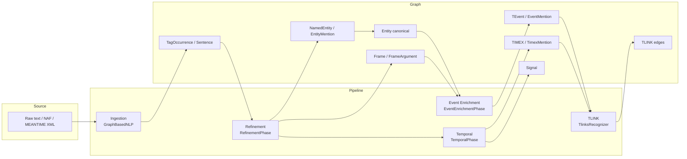
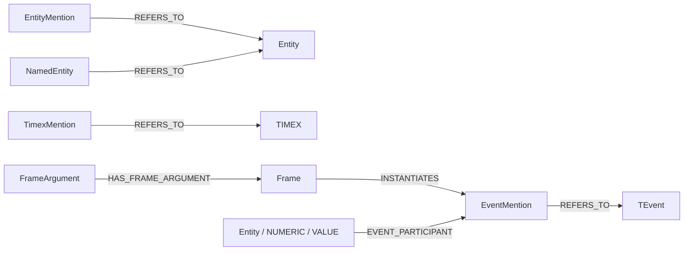
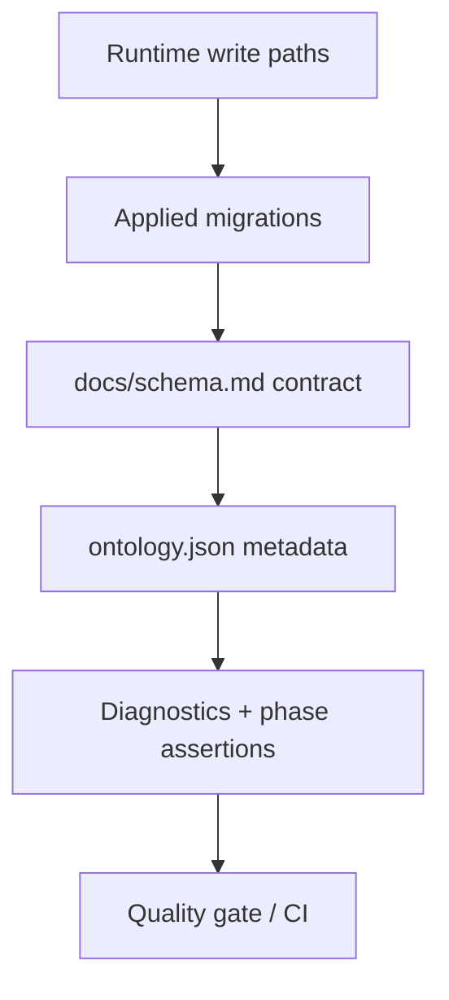

<!-- last_reviewed: 2026-04-23 | owner: core | status: draft | review_interval_days: 90 -->

# Concept Map

**Gateway** · **Wiki Home** · **Foundations** · Concept Map

## Abstract

A high-level picture of how the moving parts fit together. This is the single diagram to reach for when orienting a new reader.

## Pipeline and layers

## Mention / canonical duality

## Governance stack

See [`../../schema.md`](../../schema.md) for the authoritative text of the precedence order.

## See also

- [`theme-and-rationale.md`](theme-and-rationale.md)
- [`../20-pipeline/pipeline-theory.md`](../20-pipeline/pipeline-theory.md)
- [`../40-ontology-and-schema/schema-autogen.md`](../40-ontology-and-schema/schema-autogen.md)
