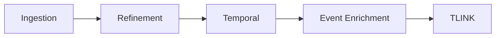

<!-- last_reviewed: 2026-04-23 | owner: core | status: draft | review_interval_days: 90 -->

# Pipeline Theory

**Gateway** · **Wiki Home** · **Pipeline** · Theory

## Abstract

TextGraphX is structured as a sequential pipeline of contract-governed phases, each owning a specific layer of the graph. This page explains why a staged pipeline is the right shape for event-centric temporal KG construction and what each stage is responsible for.

## Why a staged pipeline (not a monolith)

- **Separation of concerns.** Token/syntax, reference, time, events, and temporal relations have different evidence bases and failure modes. Colocating them in a monolithic extractor makes errors hard to attribute.
- **Contract-first composition.** Each stage writes a known subset of labels and edges; the next stage depends only on a declared subset of those invariants (see [`../40-ontology-and-schema/reasoning-contracts.md`](../40-ontology-and-schema/reasoning-contracts.md)).
- **Evaluability.** A stage-at-a-time evaluation surface (M1–M7) becomes possible; see [`../55-evaluation-strategy/README.md`](../55-evaluation-strategy/README.md).
- **Reproducibility.** Deterministic IDs and fixed stage order mean the same input produces byte-identical graph writes (modulo Neo4j ordering).

## Canonical stage order

Runner: [`src/textgraphx/run_pipeline.py`](../../../src/textgraphx/run_pipeline.py) · helper: [`src/textgraphx/scripts/run_pipeline.sh`](../../../src/textgraphx/scripts/run_pipeline.sh).

## Stage responsibilities at a glance

| Stage | Owner module | Primary outputs |
| --- | --- | --- |
| Ingestion | [`GraphBasedNLP.py`](../../../src/textgraphx/GraphBasedNLP.py) + [`text_processing_components/`](../../../src/textgraphx/text_processing_components) | `AnnotatedText`, `Sentence`, `TagOccurrence`, dependencies, `NamedEntity`, `CorefMention`, `Frame`/`FrameArgument`, WordNet enrichment |
| Refinement | [`RefinementPhase.py`](../../../src/textgraphx/RefinementPhase.py) | Canonical `Entity`, `EntityMention`, cleaned references, fused identities |
| Temporal | [`TemporalPhase.py`](../../../src/textgraphx/TemporalPhase.py) | `TIMEX`, `TimexMention`, `Signal` |
| Event enrichment | [`EventEnrichmentPhase.py`](../../../src/textgraphx/EventEnrichmentPhase.py) | `TEvent`, `EventMention`, `EVENT_PARTICIPANT` edges |
| TLINK | [`TlinksRecognizer.py`](../../../src/textgraphx/TlinksRecognizer.py) | `TLINK` edges with Allen-algebra relation types |

Each stage has a dedicated page (lands in PR-4):
`stage-ingestion.md`,
`stage-refinement.md`,
`stage-temporal.md`,
`stage-event-enrichment.md`,
`stage-tlink.md`.

## Inter-stage invariants

These are enforced by phase assertions ([`phase_assertions.py`](../../../src/textgraphx/phase_assertions.py)) and mirrored in `ontology.json` → `relation_endpoint_contract`:

- After Refinement, every `NamedEntity` must either link to an `Entity` or be explicitly marked unresolved.
- After Temporal, every `TimexMention` refers to exactly one `TIMEX`.
- After Event Enrichment, every `EventMention` refers to exactly one `TEvent`, and every `Frame --INSTANTIATES--> EventMention` has a valid mention endpoint.
- Before TLINK runs, all canonical temporal endpoints (`TEvent`, `TIMEX`) must carry the required identity fields.
- After TLINK, the TLINK set must satisfy the conservative-closure rules declared in `temporal_reasoning_profile.closure_rules`; contradictions listed in `contradiction_pairs` must not both hold for the same endpoint pair.

## Failure handling

- Each stage fails fast on hard-contract violation; no silent degradation.
- Advisory contract violations are recorded as diagnostics and do not block progression.
- The `runtime.mode` switch (`testing` / `production`) controls whether the graph is cleared before review-mode runs; production fails fast on pre-existing documents.

## Relationship to the origin paper

The five-track decomposition (nominal mention, NED, event enrichment, participant, TLINK) carried over from Hur et al. (2024), but the explicit inter-stage contracts, phase assertions, and the mention/canonical duality are extensions introduced by this repository. See [`../00-foundations/origin-paper.md`](../00-foundations/origin-paper.md).

## References

- [hur2024unifying]
- [hogan2021kg]
- [allen1983intervals]

## See also

- [`../../architecture-overview.md`](../../architecture-overview.md)
- [`../40-ontology-and-schema/reasoning-contracts.md`](../40-ontology-and-schema/reasoning-contracts.md)
- [`../55-evaluation-strategy/README.md`](../55-evaluation-strategy/README.md)
